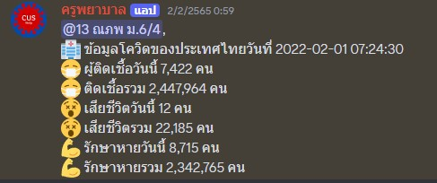

# CUS-BOT discord
A discord bot can tell you about COVID-19 statistic daily day built by Node JS , Express.
This is my first project since around 2020 or 2021. I just re upload it



## Features
- **!covid** = Get covid stat in the day
- **!area** = Get restrict area name
- **!vaccine** = Get stat of people who get injected
- **!tel** = Get list of telephone number
- **!help** = Get guideline


# Tech
- Node JS
- Express JS


## Installation
You need to have a discord Token first
1. First of all you need to clone it
```bash
  git clone https://github.com/NutNaphop/CUS-BOT.git
```
2. Get into your project and open CMD
```bash
  npm install
```
3. Create .env file at root and declare a variable
```bash
  API_KEY = <your_token>
```
4. Run your project
```bash
  node app.js
```